# Diagrams: Beads & Dolt Skills Implementation

Visual representation of the changes made during this session.

---

## 1. Directory Structure: Before vs After

### BEFORE: Flat reference docs, no skill discovery

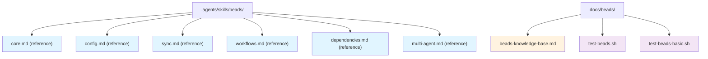

### AFTER: Layered architecture with skill discovery

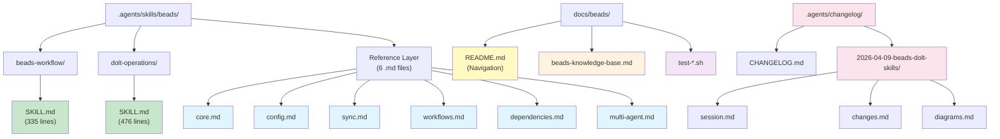

---

## 2. Documentation Architecture: Three Layers

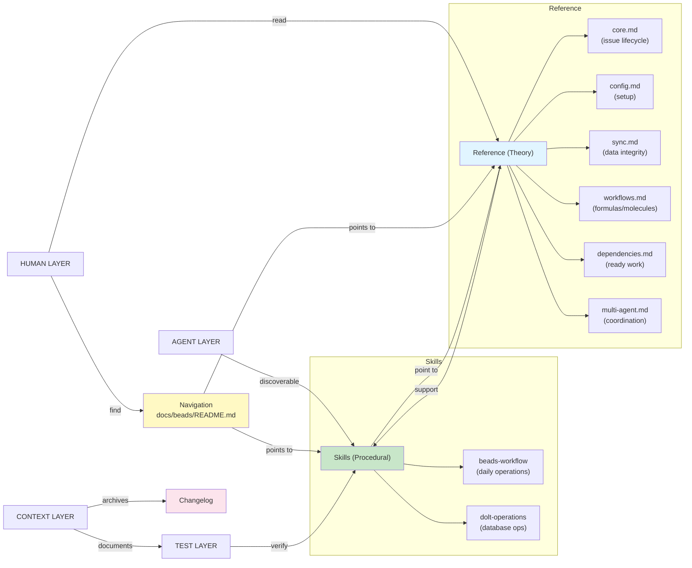

---

## 3. Skill Discovery Flow

How the pi agent framework discovers and uses the new skills:

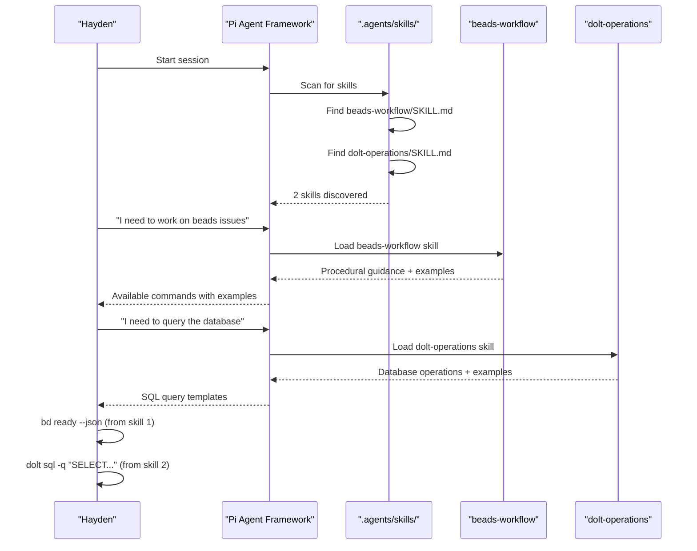

---

## 4. Daily Workflow Process

How agents use beads-workflow during daily operations:

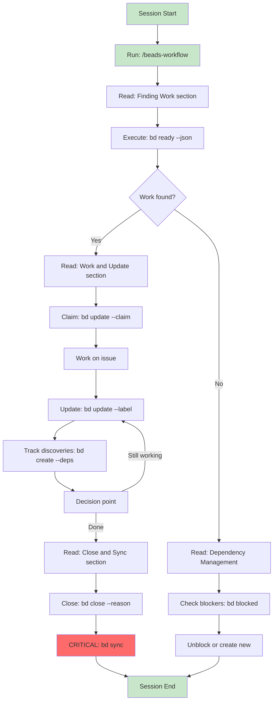

---

## 5. Database Operations Process

How agents use dolt-operations for database work:

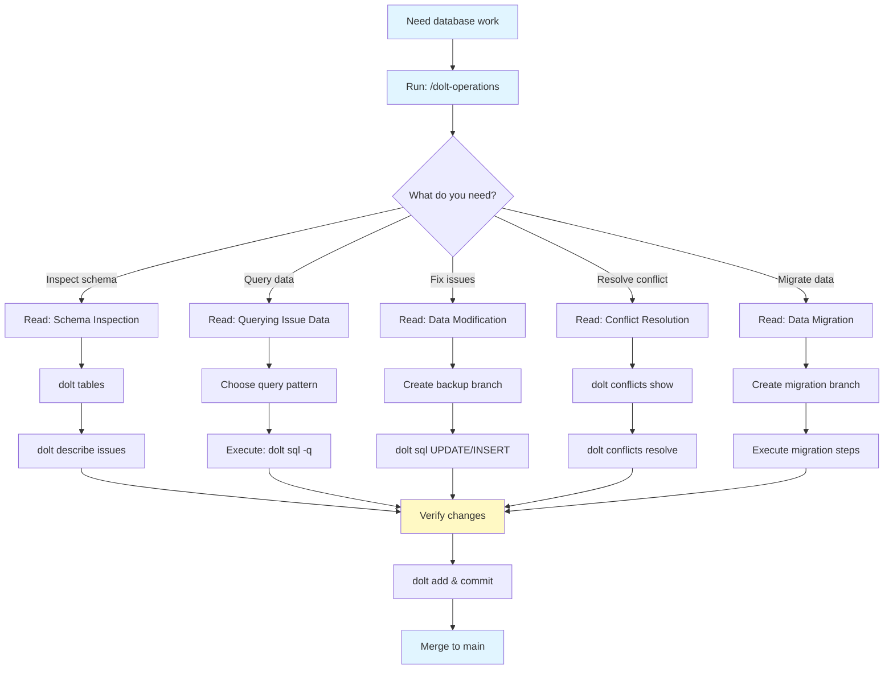

---

## 6. Documentation Navigation Paths

How humans and agents navigate the three layers:

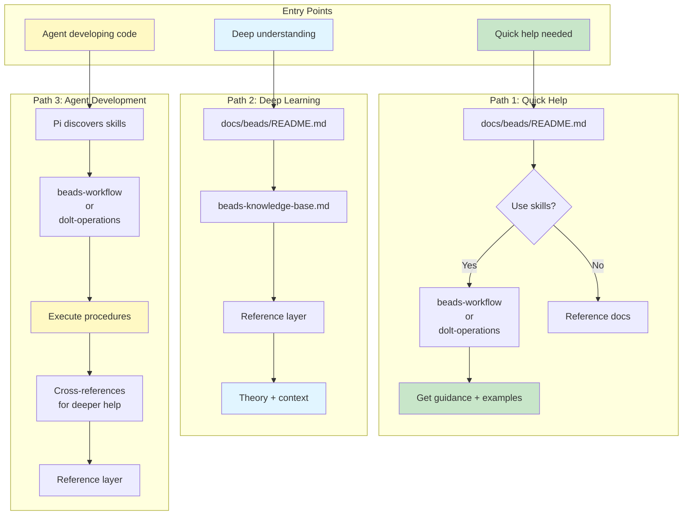

---

## 7. Integration Points: Skills ↔ Reference

How the two skills connect to each other and to reference material:

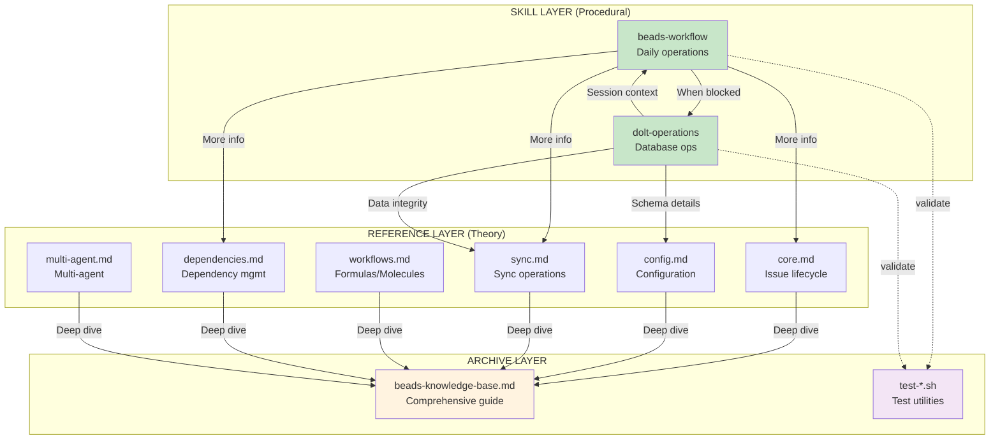

---

## 8. Changelog System: Session Documentation

How sessions are documented and organized:

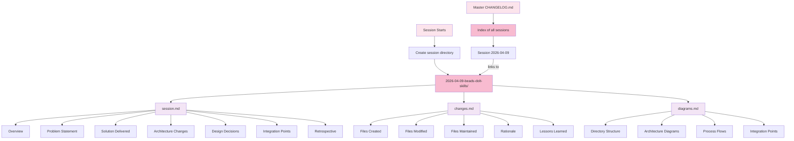

---

## 9. Summary: What Changed

```mermaid
graph LR
    subgraph Before["BEFORE<br/>Flat + No Discovery"]
        B1["6 reference docs<br/>(~23KB)"]
        B2["Knowledge base<br/>(~450 lines)"]
        B3["Test utilities"]
        B4["❌ No SKILL.md"]
        B5["❌ No dolt guidance"]
        B6["❌ No changelog"]
    end
    
    Arrow["➜ Option A<br/>Layered +<br/>Discoverable"]
    
    subgraph After["AFTER<br/>Layered + Discoverable"]
        A1["2 new SKILL.md files<br/>(811 lines)"]
        A2["✅ beads-workflow"]
        A3["✅ dolt-operations"]
        A4["6 reference docs<br/>maintained"]
        A5["Navigation hub"]
        A6["Changelog system"]
    end
    
    Before -->|Transform| Arrow
    Arrow -->|To| After
    
    style B1 fill:#e1f5ff
    style B2 fill:#fff3e0
    style B3 fill:#f3e5f5
    style B4 fill:#ffcccc
    style B5 fill:#ffcccc
    style B6 fill:#ffcccc
    
    style A1 fill:#c8e6c9
    style A2 fill:#c8e6c9
    style A3 fill:#c8e6c9
    style A4 fill:#e1f5ff
    style A5 fill:#fff9c4
    style A6 fill:#fce4ec
```

---

## 10. Impact Matrix: Who Benefits

```mermaid
graph TD
    subgraph Agents["🤖 AI AGENTS"]
        AG1["Discover beads-workflow skill"]
        AG2["Execute: bd ready, update, close, sync"]
        AG3["Discover dolt-operations skill"]
        AG4["Execute: dolt schema, sql, conflicts"]
        AG5["Follow process flows seamlessly"]
    end
    
    subgraph Humans["👤 HUMANS"]
        HU1["Quick reference: docs/beads/README.md"]
        HU2["Deep learning: Reference layer"]
        HU3["Comprehensive guide: Knowledge base"]
        HU4["Test utilities: test-*.sh"]
        HU5["See what changed over time"]
    end
    
    subgraph Project["📋 PROJECT"]
        PR1["Documented decisions in changelog"]
        PR2["Clear separation: skills vs reference"]
        PR3["Fully backward compatible"]
        PR4["Extensible pattern for future sessions"]
        PR5["Visual diagrams for understanding"]
    end
    
    AG1 -.->|Improves| PR1
    HU1 -.->|Improves| PR2
    PR1 -.->|Benefits| Agents
    PR2 -.->|Benefits| Humans
    
    style AG1 fill:#c8e6c9
    style AG2 fill:#c8e6c9
    style AG3 fill:#c8e6c9
    style AG4 fill:#c8e6c9
    style AG5 fill:#c8e6c9
    
    style HU1 fill:#e1f5ff
    style HU2 fill:#e1f5ff
    style HU3 fill:#e1f5ff
    style HU4 fill:#e1f5ff
    style HU5 fill:#e1f5ff
    
    style PR1 fill:#fce4ec
    style PR2 fill:#fce4ec
    style PR3 fill:#fce4ec
    style PR4 fill:#fce4ec
    style PR5 fill:#fce4ec
```

---

## Key Takeaways

From these diagrams, you can see:

1. **Layered architecture** separates concerns (skills, reference, archive)
2. **Skill discovery** is automatic through pi's framework
3. **Navigation is clear** for both agents and humans
4. **Cross-references** create knowledge threads
5. **Changelog system** preserves context and decisions
6. **No breaking changes** — everything is additive
7. **Clear benefits** for agents, humans, and the project

---

**See Also**:
- [Session Summary](./session.md)
- [Detailed Changes](./changes.md)
- [Master Changelog](../CHANGELOG.md)
