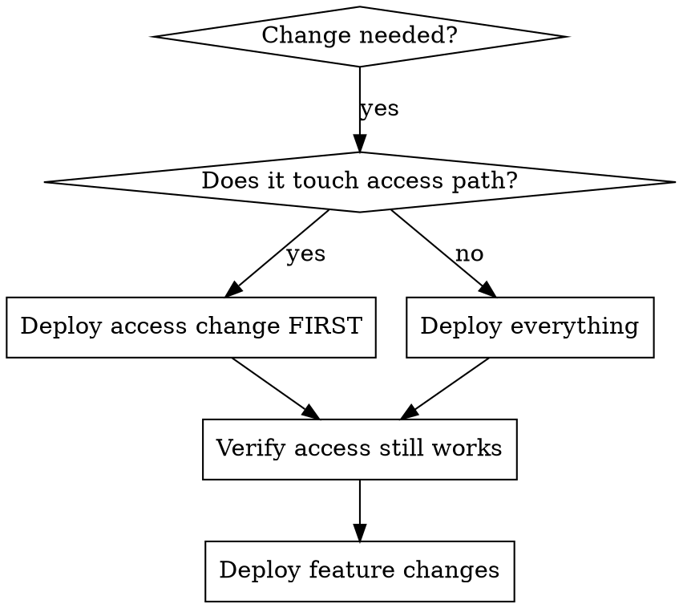

# NixOS Lockout-Safe Deployments

**See also:** `server-hardening-tailscale-safe` for generic server hardening (SSH config, firewall, fail2ban) with Tailscale.

## Overview

When deploying changes to a remote NixOS server, the access mechanism (Tailscale, WireGuard, VPN) must never be modified in the same change set as other features. If the access service breaks, you lose the ability to fix it.

**Core rule:** Separate access-path changes from feature changes. Always.

## When to Use

- Deploying NixOS config changes to a remote server
- SSH access depends on a service (Tailscale, WireGuard, VPN tunnel)
- You don't have Hetzner console / IPMI / out-of-band access
- The server uses hardened SSH (Tailscale-only, no public internet SSH)

## Red Flags - STOP

- About to modify Tailscale config AND add new services in the same change
- Changing auth keys, SSH hardening, or firewall rules alongside features
- "I'll just change this one Tailscale flag while I'm here"
- No verification step after the first rebuild

## The Pattern



### Step 1: Identify the Access Path

Before making any changes, answer: "How do I SSH into this machine?"

| Access Path | What NOT to touch in the same deploy |
|-------------|--------------------------------------|
| Tailscale | `services.tailscale`, auth keys, `tailscale-enhanced.nix` |
| WireGuard | WireGuard config, keys, firewall rules |
| Public SSH | `services.openssh`, firewall port 22, SSH keys |
| VPN | VPN client config, auth, routing |

### Step 2: Separate Changes

```
CHANGE SET A (access path):
  - Modify Tailscale auth key
  - Rebuild
  - Verify: tailscale status
  - Verify: can still SSH in

CHANGE SET B (features):
  - Add opnix module
  - Add new services
  - Rebuild
  - Verify: services running
```

### Step 3: Deploy and Verify Between Each Change

```bash
# Deploy access change
sudo nixos-rebuild switch --flake .#hostname

# IMMEDIATELY verify access
tailscale status --self
ssh hbohlen@hostname 'echo "still here"'

# Only then deploy features
sudo nixos-rebuild switch --flake .#hostname
```

## Verification Template

After EVERY rebuild, run this checklist:

```bash
# 1. Can I still reach the machine?
tailscale status --self

# 2. Is SSH working?
ssh hbohlen@<tailscale-ip> 'whoami && hostname'

# 3. Is the critical service running?
systemctl status tailscaled  # or your access service

# 4. Are new services running?
systemctl status <new-service>
```

## Common Mistakes

| Mistake | Consequence |
|---------|-------------|
| Changing Tailscale + adding services together | Tailscale breaks, can't SSH to fix it |
| Changing SSH hardening + firewall in same deploy | Firewall blocks SSH, locked out |
| Not verifying after each `nixos-rebuild switch` | Don't notice breakage until too late |
| Changing bootloader + normal config together | Boot failure, need Hetzner rescue |
| Modifying disk layout + features together | Filesystem issue, need reinstall |

## Recovery Path

If you DO get locked out:

1. **Check Hetzner server status:** `hcloud server describe <name>`
2. **Enable rescue mode** via Hetzner console
3. **Boot into rescue**, mount NixOS filesystem
4. **Revert the generation:** `nixos-rebuild switch --rollback` (or edit config)
5. **Reboot** into normal mode

If no rescue access exists: you need to be even more careful. Consider keeping a spare SSH key authorized for root with public-internet access as emergency fallback.

## Checklist for Remote NixOS Deploys

- [ ] Identified the access path (Tailscale, WireGuard, etc.)
- [ ] Separated access changes from feature changes
- [ ] Verified `nix build` succeeds before deploying
- [ ] Deployed access changes FIRST (if any)
- [ ] Verified access still works after access changes
- [ ] Deployed feature changes
- [ ] Verified access AND features after feature changes