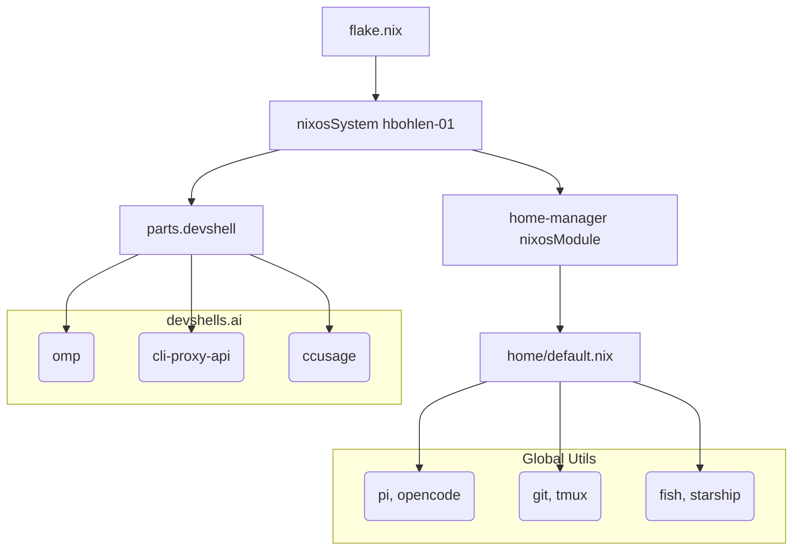

# Design Document: clean-project

## Overview
This design implements a cleanup refactoring of the hbohlen-systems Nix configuration. It strips away outmoded services (caddy, gno) and shifts the heavy-lifting of standard terminal development tools from `devShells` into globally integrated `home-manager` configurations.

### Goals
- Cut `ai` devShell initialization bottlenecks.
- Achieve a single source of truth for global CLI tools across all shell boundaries via `home-manager`.
- Move `home-manager` fully inside the NixOS configuration evaluation graph.

### Non-Goals
- Altering the fundamental multi-agent system behavior of opencode, pi, etc.

## Architecture
The system transitions from standalone module boundaries that were evaluating `home-manager` using `flake-parts` hooks directly into `NixOS system` integrations.

## Components and Interfaces

### `home/default.nix`
- **Role:** Central unit handling all non-flake shell packages, CLI extensions, and standard LLM agents (e.g. `opencode`, `hermes-agent`).
- **Interfaces:** Exports a valid `{ inputs, pkgs, ... }` functor suitable for ingestion inside `nixosSystem` configurations. It delegates fish and starship to `programs.fish` and `programs.starship` natively rather than manual scripts.

### `parts/devshell.nix`
- **Role:** Fast, focused environments containing only specialized agents needing strict workspace boundaries (e.g. `omp`).
- **Changes:** `agent-menu` deletion and extensive package stripping back to `home-manager`.

### `flake.nix`
- **Role:** Test and evaluation integrity.
- **Changes:** Append broader repository scopes to `alejandra-check` and `deadnix-check`.

## Traceability

| Requirement ID | Design Element |
| -------------- | -------------- |
| **1.1** | Deletion of caddy/gno configs and their refs inside NixOS modules. |
| **1.3** | `home/default.nix` transitioned to standard signature. |
| **2.1, 2.2, 2.3** | Moves from `devshell.nix` to `home.packages` and enables `programs.fish`. |
| **2.4** | `agent-menu` removal. |
| **3.1** | Addition of `lib`, `scripts`, `secrets` to check derivations. |
