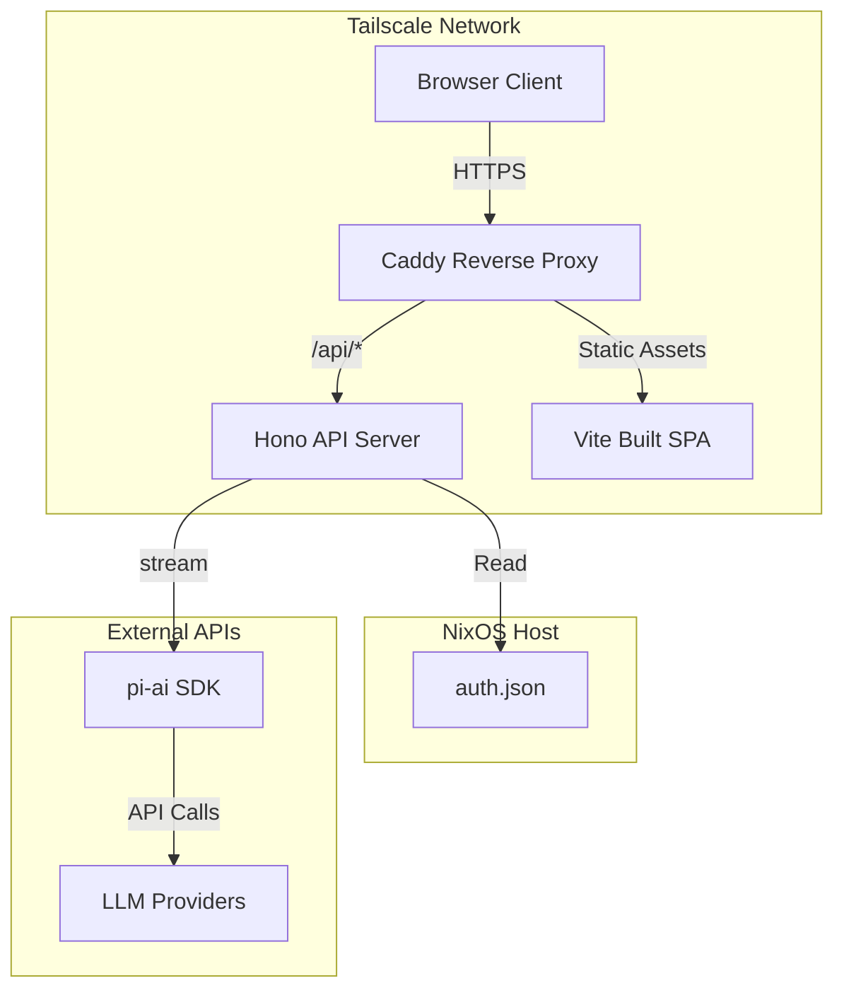
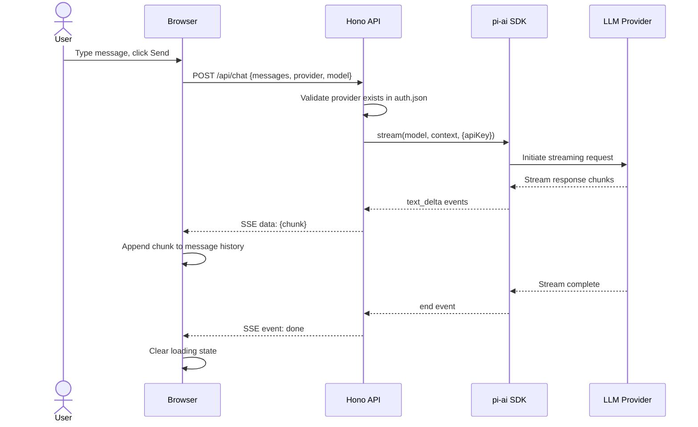
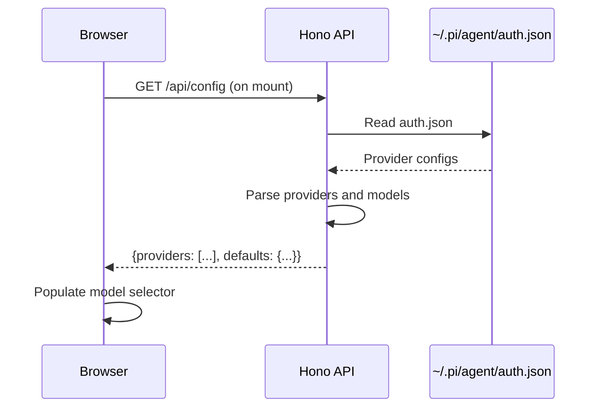
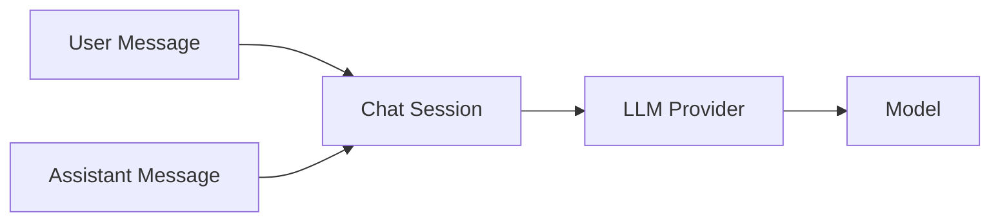

# Design Document: pi-web-ui-integration

## Overview

**Purpose**: Deliver a web-based chat interface for interacting with authenticated LLM models via the `@mariozechner/pi-ai` SDK. Users can select from configured providers, send messages, and receive streaming responses through a browser accessible only via Tailscale.

**Users**: Personal infrastructure administrators who want browser-based access to their pi-authenticated LLM providers without installing the CLI on every device. The interface targets single-user deployment on a private tailnet.

**Impact**: Adds a new user-facing service to the hbohlen-systems infrastructure—a React SPA served by a Node.js backend that proxies LLM calls through the pi-ai SDK. The service integrates with existing Tailscale networking and Caddy reverse proxy patterns.

### Goals
- Provide a responsive dark-themed chat interface matching pi CLI aesthetic
- Support all pi-authenticated providers (Anthropic, OpenAI, Google, GitHub Copilot, etc.)
- Stream LLM responses in real-time to the browser
- Deploy securely behind Tailscale with no public internet exposure
- Require zero session persistence or database (MVP scope)

### Non-Goals
- Multi-user support or authentication (single-user tailnet access only)
- Conversation history or persistence across page reloads
- Tool calling (bash, read, write, edit) integration
- File uploads or attachment handling
- Mobile-responsive optimization (desktop/tablet only)

## Architecture

### Architecture Pattern & Boundary Map



**Architecture Integration**:
- **Selected pattern**: Client-Server SPA with API proxy
- **Domain boundaries**: Frontend (presentation), Backend (API/proxy), External (LLM providers)
- **Existing patterns preserved**: Tailscale service isolation, Caddy reverse proxy, 1Password secret management
- **New components rationale**: Hono API server provides lightweight TypeScript backend; React SPA enables rich chat UI without page reloads

### Technology Stack

| Layer | Choice / Version | Role in Feature | Notes |
|-------|------------------|-----------------|-------|
| Frontend | React 18 + Vite 5 + TypeScript 5.3 | SPA chat interface | Build outputs to `dist/` served by backend |
| UI Components | shadcn/ui + Tailwind CSS 3.4 | Dark-themed components | Consistent with pi CLI aesthetic |
| Backend | Node.js 20 + Hono 4.x | API server | Lightweight, TypeScript-native, streaming support |
| Streaming | Server-Sent Events (SSE) | Real-time LLM responses | Text/event-stream content type |
| LLM Integration | @mariozechner/pi-ai ^0.66 | Provider abstraction | Handles all auth and streaming normalization |
| Networking | Tailscale + Caddy 2.x | Private access + HTTPS | Tailnet-only, auto-HTTPS via Tailscale certs |
| Runtime | systemd service | Process management | NixOS module manages service lifecycle |

## System Flows

### Message Send and Stream Flow



**Key Decisions**:
- SSE chosen over WebSockets for simpler one-way streaming from server to client
- pi-ai SDK abstracts provider-specific streaming formats into normalized events
- Frontend maintains message history in React state (no persistence)

### Configuration Load Flow



## Requirements Traceability

| Requirement | Summary | Components | Interfaces | Flows |
|-------------|---------|------------|------------|-------|
| 1.1 | Chat interface loads | ChatPage, MessageList | - | - |
| 1.2 | Message history display | MessageList, MessageBubble | - | - |
| 1.3 | Text input field | ChatInput | - | - |
| 1.4 | Send button | ChatInput | - | - |
| 1.5 | Dark theme styling | Tailwind Config, shadcn components | - | - |
| 1.6 | Responsive layout | ChatPage | - | - |
| 2.1 | Fetch models from /api/config | ChatPage | GET /api/config | Config Load Flow |
| 2.2 | Model selector dropdown | ModelSelector | - | - |
| 2.3 | Store selection in memory | useChatStore (zustand) | - | - |
| 2.4 | Empty state message | ModelSelector | - | - |
| 2.5 | Display selected model | ModelSelector | - | - |
| 3.1 | POST /api/chat with message | ChatInput | POST /api/chat | Message Send Flow |
| 3.2 | Loading indicator | MessageBubble (streaming state) | - | Message Send Flow |
| 3.3 | Real-time chunk append | MessageList | SSE /api/chat | Message Send Flow |
| 3.4 | Clear indicator on complete | MessageBubble | SSE end event | Message Send Flow |
| 3.5 | Error display | ErrorToast | HTTP 4xx/5xx | - |
| 3.6 | Clear input after send | ChatInput | - | - |
| 3.7 | Auto-scroll to latest | MessageList | - | - |
| 4.1 | Read auth.json on startup | ConfigService | - | - |
| 4.2 | Handle missing auth.json | ConfigService | - | - |
| 4.3 | Parse providers | ConfigService | - | - |
| 4.4 | Configurable port | Hono app | - | - |
| 4.5 | Serve static files | serveStatic middleware | - | - |
| 5.1 | GET /api/config endpoint | ConfigController | GET /api/config | Config Load Flow |
| 5.2 | Response format | ConfigService | ConfigResponse | - |
| 5.3 | Provider string format | ConfigService | - | - |
| 5.4 | Empty providers array | ConfigService | - | - |
| 5.5 | Response time target | ConfigService | - | - |
| 6.1 | POST /api/chat endpoint | ChatController | POST /api/chat | Message Send Flow |
| 6.2 | Validate provider | ChatService | - | - |
| 6.3 | Call LLM via pi-ai | ChatService | stream() call | Message Send Flow |
| 6.4 | Stream chunks via SSE | ChatController | SSE response | Message Send Flow |
| 6.5 | Close stream on complete | ChatController | - | Message Send Flow |
| 6.6 | Return 500 on LLM error | ChatController | HTTP 500 | - |
| 7.1 | Import pi-ai SDK | ChatService | - | - |
| 7.2 | Call stream() function | ChatService | stream() | Message Send Flow |
| 7.3 | Map provider names | ConfigService | - | - |
| 7.4 | Pass apiKey from auth.json | ChatService | - | - |
| 7.5 | Support all providers | pi-ai SDK | - | - |
| 8.1 | Internal network only | NixOS module | - | - |
| 8.2 | Tailscale domain | Caddy config | - | - |
| 8.3 | Caddy routes to backend | Caddy config | - | - |
| 8.4 | Tailnet-only access | Tailscale ACLs | - | - |
| 8.5 | HTTPS traffic | Caddy + Tailscale | - | - |
| 9.1 | React + Vite + TypeScript | Frontend | - | - |
| 9.2 | Node.js + Hono | Backend | - | - |
| 9.3 | Pinned package.json | npm | - | - |
| 9.4 | Build command | npm scripts | - | - |
| 9.5 | Modern browser support | Browserslist config | - | - |
| 9.6 | Node.js 18+ | Backend | - | - |
| 10.1 | Backend unreachable error | ErrorToast | - | - |
| 10.2 | Rate limit error | ErrorToast | 429 response | - |
| 10.3 | Unauthenticated provider | ErrorToast | 400 response | - |
| 10.4 | Empty input disabled | ChatInput | - | - |
| 10.5 | Error logging | Backend logger, browser console | - | - |

## Components and Interfaces

### Frontend (Presentation Layer)

| Component | Domain/Layer | Intent | Req Coverage | Key Dependencies (P0/P1) | Contracts |
|-----------|--------------|--------|--------------|--------------------------|-----------|
| ChatPage | UI/Page | Main chat interface container | 1.1, 1.6 | MessageList (P0), ChatInput (P0), ModelSelector (P0) | State |
| MessageList | UI/Display | Render scrollable message history | 1.2, 3.7 | MessageBubble (P0) | Props |
| MessageBubble | UI/Display | Individual message with streaming state | 1.5, 3.2 | - | Props |
| ChatInput | UI/Input | Message composition and send | 1.3, 1.4, 3.1, 3.6, 10.4 | useChatStore (P0) | State, Callback |
| ModelSelector | UI/Input | Provider/model dropdown | 2.2, 2.4, 2.5 | useChatStore (P0) | State |
| ErrorToast | UI/Feedback | Display error messages | 3.5, 10.1, 10.2, 10.3 | - | Props |
| useChatStore | State | Zustand store for chat state | 2.3 | - | State |

#### ChatPage

| Field | Detail |
|-------|--------|
| Intent | Root page component orchestrating chat UI layout and data fetching |
| Requirements | 1.1, 1.6, 2.1 |

**Responsibilities & Constraints**
- Mounts and fetches configuration from `/api/config`
- Manages layout: header (model selector), main (message list), footer (input)
- Responsive flexbox layout with max-width constraint

**Dependencies**
- Inbound: None
- Outbound: Config API (P0), useChatStore (P0)

**Contracts**: State

##### State Management
- State model: Zustand store (`useChatStore`)
- Persistence: None (MVP)
- Structure: `{ messages: Message[], selectedProvider: string, selectedModel: string, isStreaming: boolean }`

---

#### useChatStore (Zustand)

| Field | Detail |
|-------|--------|
| Intent | Centralized chat state management |
| Requirements | 2.3 |

**Responsibilities & Constraints**
- Store message history array
- Track selected provider and model
- Manage streaming state flag

**Dependencies**
- Inbound: ChatInput, ModelSelector, MessageList
- Outbound: None

**Contracts**: State

##### State Interface
```typescript
interface ChatState {
  messages: Message[];
  selectedProvider: string | null;
  selectedModel: string | null;
  isStreaming: boolean;
  addMessage: (role: 'user' | 'assistant', content: string) => void;
  appendToLastMessage: (chunk: string) => void;
  setSelectedModel: (provider: string, model: string) => void;
  setStreaming: (streaming: boolean) => void;
  clearMessages: () => void;
}

interface Message {
  id: string;
  role: 'user' | 'assistant';
  content: string;
  timestamp: number;
}
```

---

### Backend (API Layer)

| Component | Domain/Layer | Intent | Req Coverage | Key Dependencies (P0/P1) | Contracts |
|-----------|--------------|--------|--------------|--------------------------|-----------|
| Hono App | API/Server | HTTP server and routing | 4.4, 4.5 | Controllers (P0) | API |
| ConfigController | API/Controller | Configuration endpoints | 5.1 | ConfigService (P0) | API |
| ChatController | API/Controller | Chat and streaming endpoints | 6.1, 6.4, 6.5, 6.6 | ChatService (P0) | API |
| ConfigService | Business/Service | Parse auth.json, provide config | 4.1, 4.2, 4.3, 5.2, 5.3, 5.4, 5.5, 7.3 | fs (P0) | Service |
| ChatService | Business/Service | LLM integration via pi-ai | 6.2, 6.3, 7.1, 7.2, 7.4, 7.5 | pi-ai SDK (P0), ConfigService (P0) | Service |

#### Hono App

| Field | Detail |
|-------|--------|
| Intent | HTTP server setup, middleware, and route registration |
| Requirements | 4.4, 4.5, 9.2, 9.6 |

**Responsibilities & Constraints**
- Configure CORS for same-origin requests
- Mount serveStatic middleware for `dist/` directory
- Register `/api/config` and `/api/chat` routes
- Start server on configurable port (default 3000)

**Dependencies**
- Inbound: Caddy reverse proxy
- Outbound: ConfigController, ChatController

**Contracts**: API

##### API Contract Summary
| Method | Endpoint | Handler | Purpose |
|--------|----------|---------|---------|
| GET | /api/config | ConfigController.getConfig | Return available providers |
| POST | /api/chat | ChatController.postChat | Stream LLM response |
| GET | /* | serveStatic | Serve frontend SPA |

---

#### ConfigService

| Field | Detail |
|-------|--------|
| Intent | Read and parse pi agent authentication configuration |
| Requirements | 4.1, 4.2, 4.3, 5.2, 5.3, 5.4, 5.5, 7.3 |

**Responsibilities & Constraints**
- Read `~/.pi/agent/auth.json` on startup
- Handle missing file gracefully (empty providers)
- Parse provider entries into normalized format
- Format provider strings as `"{provider}/{model}"`

**Dependencies**
- Inbound: ConfigController
- Outbound: fs (Node.js), ChatService
- External: auth.json file

**Contracts**: Service

##### Service Interface
```typescript
interface ConfigService {
  loadConfig(): Promise<AgentConfig>;
  getProviders(): string[];
  getDefaultProvider(): { provider: string; model: string } | null;
  getApiKey(provider: string): string | undefined;
}

interface AgentConfig {
  version: number;
  providers: Record<string, ProviderConfig>;
}

interface ProviderConfig {
  apiKey: string;
  models: string[];
  defaultModel: string;
}
```

**Implementation Notes**
- Integration: File path resolved via `process.env.HOME` or `os.homedir()`
- Validation: JSON schema validation for auth.json structure
- Risks: File permissions may prevent read; fallback to empty config

---

#### ChatService

| Field | Detail |
|-------|--------|
| Intent | Stream LLM responses via pi-ai SDK |
| Requirements | 6.2, 6.3, 7.1, 7.2, 7.4, 7.5 |

**Responsibilities & Constraints**
- Validate provider exists in configuration
- Map provider names to pi-ai identifiers
- Call `stream()` with appropriate API key
- Yield normalized text chunks

**Dependencies**
- Inbound: ChatController
- Outbound: ConfigService (P0)
- External: @mariozechner/pi-ai SDK (P0)

**Contracts**: Service

##### Service Interface
```typescript
interface ChatService {
  streamChat(
    messages: ChatMessage[],
    provider: string,
    model: string
  ): AsyncIterable<StreamChunk>;
}

interface ChatMessage {
  role: 'user' | 'assistant';
  content: string;
}

interface StreamChunk {
  type: 'text_delta' | 'error' | 'done';
  content?: string;
  error?: string;
}
```

**Implementation Notes**
- Integration: pi-ai SDK handles all provider-specific streaming
- Validation: Verify provider exists before calling stream
- Risks: OAuth tokens may expire mid-stream; pi-ai handles refresh

---

#### ConfigController

| Field | Detail |
|-------|--------|
| Intent | HTTP handler for configuration endpoints |
| Requirements | 5.1 |

**Contracts**: API

##### API Contract
| Method | Endpoint | Request | Response | Errors |
|--------|----------|---------|----------|--------|
| GET | /api/config | - | ConfigResponse | 500 |

```typescript
interface ConfigResponse {
  providers: string[];        // e.g., ["anthropic/claude-sonnet-4-5", "openai/gpt-4o"]
  defaults: {
    provider: string;
    model: string;
  } | null;
}
```

---

#### ChatController

| Field | Detail |
|-------|--------|
| Intent | HTTP handler for chat streaming endpoint |
| Requirements | 6.1, 6.4, 6.5, 6.6 |

**Contracts**: API

##### API Contract
| Method | Endpoint | Request | Response | Errors |
|--------|----------|---------|----------|--------|
| POST | /api/chat | ChatRequest | SSE stream | 400, 500 |

```typescript
interface ChatRequest {
  messages: Array<{ role: 'user' | 'assistant'; content: string }>;
  provider: string;  // e.g., "anthropic"
  model: string;     // e.g., "claude-sonnet-4-5"
}

// SSE Event Types:
// data: {"type":"text_delta","content":"chunk"}
// data: {"type":"done"}
// data: {"type":"error","error":"message"}
```

---

### Infrastructure (NixOS Integration)

| Component | Domain/Layer | Intent | Req Coverage | Key Dependencies (P0/P1) | Contracts |
|-----------|--------------|--------|--------------|--------------------------|-----------|
| pi-web-ui module | NixOS/Module | Service definition and config | 8.1, 8.4 | systemd (P0), Caddy (P0) | Config |
| Caddy config | NixOS/Service | Reverse proxy and HTTPS | 8.2, 8.3, 8.5 | pi-web-ui service (P0) | Config |

**Implementation Notes**
- Service runs as systemd service with hardening (no network except loopback + Tailscale)
- Caddy config routes `mnemosyne.hbohlen.systems` to localhost:3000
- Tailscale ACLs enforce tailnet-only access

## Data Models

### Domain Model



**Key Concepts**:
- **Chat Session**: Ephemeral in-memory conversation (no persistence)
- **Message**: User or assistant content with metadata
- **Provider**: LLM service (Anthropic, OpenAI, etc.)
- **Model**: Specific model ID within a provider

### Data Contracts

#### Frontend-to-Backend

**GET /api/config Response**
```typescript
interface ConfigResponse {
  providers: string[];  // Formatted as "provider/model"
  defaults: {
    provider: string;
    model: string;
  } | null;
}
```

**POST /api/chat Request**
```typescript
interface ChatRequest {
  messages: ChatMessage[];
  provider: string;
  model: string;
}

interface ChatMessage {
  role: 'user' | 'assistant';
  content: string;
}
```

**POST /api/chat Response (SSE)**
```
Content-Type: text/event-stream

data: {"type":"text_delta","content":"Hello"}

data: {"type":"text_delta","content":" world"}

data: {"type":"done"}
```

#### Backend Configuration

**auth.json Schema (read-only)**
```typescript
interface AuthConfig {
  version: number;
  providers: Record<string, {
    type: string;
    apiKey: string;
    models: string[];
    defaultModel: string;
  }>;
}
```

## Error Handling

### Error Strategy
- **Fail fast** on configuration errors at startup
- **Graceful degradation** when auth.json is missing (empty providers list)
- **User-friendly messages** for all error conditions
- **Structured logging** for backend debugging

### Error Categories and Responses

| Category | Scenario | Frontend Behavior | Backend Response |
|----------|----------|-------------------|------------------|
| User Error (4xx) | Invalid provider | Toast: "Provider not configured" | 400 Bad Request |
| User Error (4xx) | Empty message | Disable send button | N/A (client-side) |
| System Error (5xx) | Backend unreachable | Toast: "Unable to connect to server" | Connection failed |
| System Error (5xx) | LLM rate limit | Toast: "Rate limit hit, please try again later" | 500 + error message |
| System Error (5xx) | LLM auth failure | Toast: "Authentication failed, check pi CLI" | 500 + error message |

### Monitoring
- Backend logs all requests and errors with structured JSON
- Log levels: INFO (requests), WARN (auth.json issues), ERROR (LLM failures)
- No metrics/monitoring stack integration in MVP

## Testing Strategy

### Unit Tests
- ConfigService: Parse valid auth.json, handle missing file, handle malformed JSON
- ChatService: Validate provider lookup, handle missing provider
- useChatStore: State updates, message appending, streaming flag

### Integration Tests
- GET /api/config returns correct provider list
- POST /api/chat validates provider and returns SSE stream
- Frontend fetches config on mount and populates selector
- End-to-end message send and stream receive

### E2E Tests
- Complete user flow: load page → select model → type message → send → receive streaming response
- Error flow: send with invalid provider → see error toast

## Security Considerations

- **Network isolation**: Service only accessible via Tailscale (no public internet exposure)
- **Secret handling**: API keys remain in auth.json, never logged or exposed to frontend
- **No authentication**: Relies on Tailscale network-level access control (single-user tailnet assumption)
- **CORS**: Restrict to same-origin only
- **Input validation**: Sanitize message content to prevent injection attacks

## Performance Considerations

- **Response time**: Config endpoint targets <100ms (no external I/O)
- **Streaming latency**: First chunk should arrive within 2-3 seconds (provider-dependent)
- **Memory**: No persistence means memory usage proportional to conversation length
- **Concurrent users**: Single-user design, no concurrency controls needed

---

*Design generated: April 9, 2026*
*Next step: Generate tasks.md after design approval*
