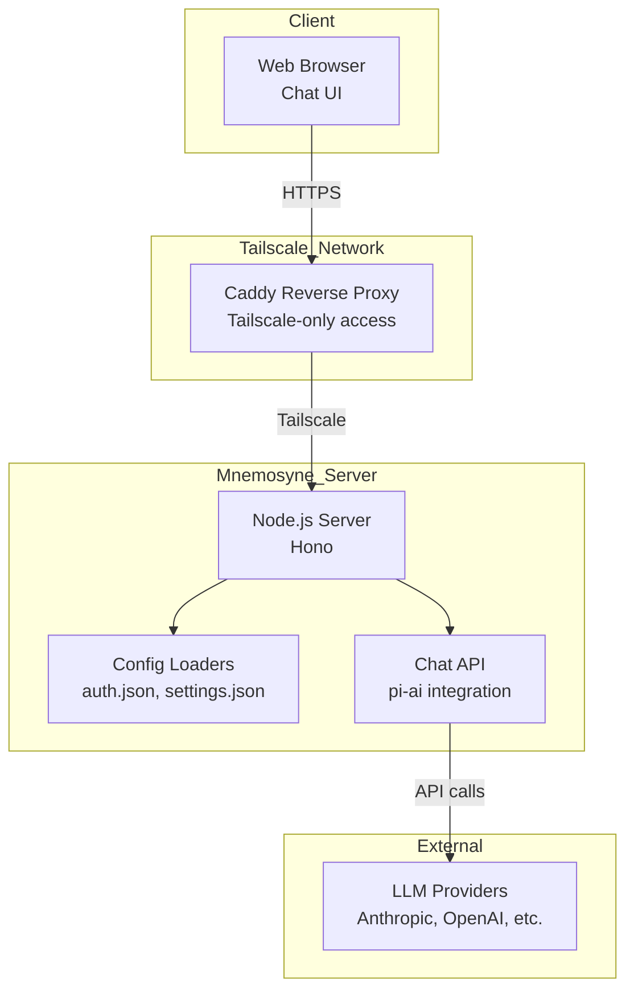
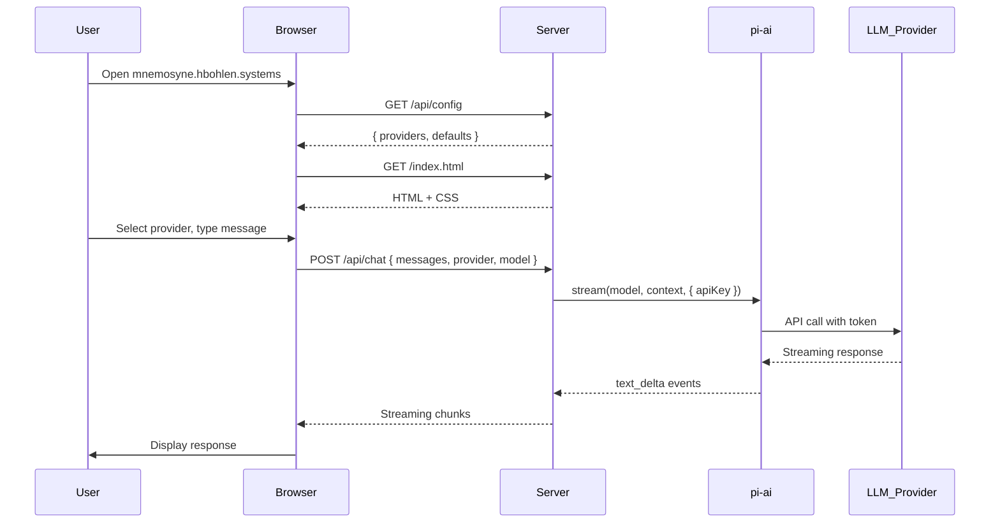

# Design Document: Mnemosyne Web UI - Phase 1

**Date:** 2026-04-08  
**Feature:** pkm-system-infrastructure  
**Language:** en

---

## Overview

**Purpose:** This feature delivers a simple web-based chat interface for Mnemosyne PKM system that reads authentication from local pi configuration (`~/.pi/agent/`) and provides model selection based on configured providers.

**Users:** System administrators and users who want to interact with AI agents through a web interface accessible via Tailscale.

**Impact:** Creates new web service component that proxies LLM calls using pi-mono packages, leveraging existing pi configuration for authentication.

### Goals
- Simple chat interface with message input and response display
- Model selector showing available providers from pi auth.json
- Streaming LLM responses
- Dark theme matching pi CLI aesthetic

### Non-Goals
- Session persistence (deferred to future phase)
- Tool calling functionality (deferred to future phase)
- File attachments (deferred to future phase)
- Knowledge base integration (deferred to future phase)

---

## Architecture

### Architecture Pattern & Boundary Map



**Architecture Integration:**
- Selected pattern: Client-Server with Backend-for-Frontend (BFF)
- Domain boundaries: UI layer (static HTML), API layer (Hono routes), Config layer (file readers), LLM layer (pi-ai)
- Existing patterns preserved: None - new component
- New components rationale: Need a service to proxy LLM calls while keeping credentials server-side
- Steering compliance: Uses Node.js with TypeScript (aligned with pi-mono packages)

### Technology Stack

| Layer | Choice / Version | Role in Feature | Notes |
|-------|------------------|-----------------|-------|
| Frontend | Plain HTML/CSS/JS | Chat UI | Simple, no build step |
| Backend | Hono ^4.0 | HTTP server | Lightweight, TypeScript-first |
| LLM SDK | @mariozechner/pi-ai ^0.66 | LLM API calls | Direct use of pi package |
| Runtime | Node.js (or Bun) | Server runtime | Required for pi-ai |
| Config | File system | Auth/settings loading | Reads from ~/.pi/agent/ |

---

## System Flows



---

## Requirements Traceability

| Requirement | Summary | Components | Interfaces | Flows |
|-------------|---------|------------|------------|-------|
| 2.1 | pi application available in system | Server, ConfigLoader | HTTP, File | Startup flow |
| 2.2 | Built from TypeScript source | Server, pi-ai | npm import | Build step |
| 2.3 | Node.js runtime provided | Server | Runtime | Deployment |
| 2.4 | pi-mono packages available | pi-ai | npm import | Dependencies |
| 2.5 | API key storage configured | ConfigLoader | File read | Auth loading |
| 3.1 | Caddy routes to web app | Proxy | Reverse proxy | Network config |
| 3.2 | Tailscale access allowed | Proxy | Network | Tailscale ACL |
| 3.3 | Outside tailnet denied | Proxy | Network | Tailscale ACL |
| 3.4 | HTTPS provided | Proxy | TLS | Caddy config |

---

## Components and Interfaces

### Component Summary

| Component | Domain/Layer | Intent | Req Coverage | Key Dependencies | Contracts |
|-----------|--------------|--------|--------------|-------------------|-----------|
| Server | Backend | HTTP server, routing | 2.1-2.5, 3.1-3.4 | ConfigLoader, ChatAPI | HTTP |
| ConfigLoader | Config | Load pi auth/settings | 2.5 | File system | Service |
| ChatAPI | API | LLM proxy | 2.4, 2.5 | pi-ai | API |

---

### Backend

#### Server

| Field | Detail |
|-------|--------|
| Intent | Main HTTP server that serves UI and provides chat API |
| Requirements | 2.1, 2.2, 2.3, 2.4, 2.5, 3.1, 3.2, 3.3, 3.4 |

**Responsibilities & Constraints**
- Serves static HTML/CSS files
- Provides `/api/config` endpoint for UI initialization
- Provides `/api/chat` endpoint for LLM interactions
- Runs on configurable port (default: 3000)

**Dependencies**
- Inbound: HTTP requests from clients
- Outbound: ConfigLoader, ChatAPI
- External: File system (auth.json, settings.json)

**Contracts**: Service [ ]

**Implementation Notes**
- Runs behind Caddy reverse proxy (handled at infrastructure level)
- Tailscale-only access configured in Caddy (not in this component)

---

#### ConfigLoader

| Field | Detail |
|-------|--------|
| Intent | Reads and parses pi configuration files for authentication and settings |
| Requirements | 2.5 |

**Responsibilities & Constraints**
- Reads `~/.pi/agent/auth.json` for OAuth tokens and API keys
- Reads `~/.pi/agent/settings.json` for default provider/model
- Provides error handling if files missing or malformed

**Dependencies**
- Inbound: Server (calls on startup)
- Outbound: File system
- External: None

**Contracts**: Service [ ]

```typescript
interface ConfigLoader {
  loadAuth(): PiAuth;
  loadSettings(): PiSettings;
  getProviders(auth: PiAuth): string[];
  getDefaults(settings: PiSettings): { provider: string; model: string };
}

interface PiAuth {
  [provider: string]: {
    type: string;
    access: string;
    refresh?: string;
    expires?: number;
    [key: string]: unknown;
  };
}

interface PiSettings {
  defaultProvider?: string;
  defaultModel?: string;
  [key: string]: unknown;
}
```

**Implementation Notes**
- Expands `~/` to actual home directory path
- Logs warnings if config files missing
- Logs loaded providers on startup for debugging

---

#### ChatAPI

| Field | Detail |
|-------|--------|
| Intent | Proxies chat requests to LLM providers using pi-ai |
| Requirements | 2.4, 2.5 |

**Responsibilities & Constraints**
- Validates request contains provider and model
- Maps pi provider names to pi-ai provider IDs
- Streams LLM responses back to client
- Handles errors gracefully

**Dependencies**
- Inbound: Server (HTTP requests)
- Outbound: pi-ai library
- External: LLM providers (Anthropic, OpenAI, Google, etc.)

**Contracts**: API [ ]

| Method | Endpoint | Request | Response | Errors |
|--------|----------|---------|----------|--------|
| GET | /api/providers | - | `{ providers: string[] }` | 500 |
| GET | /api/config | - | `{ providers, defaults }` | 500 |
| POST | /api/chat | `{ messages, provider, model }` | Streaming text | 400, 500 |

**API Contract**
```typescript
// POST /api/chat request
interface ChatRequest {
  messages: Array<{ role: string; content: string }>;
  provider: string;
  model: string;
}

// GET /api/config response
interface ConfigResponse {
  providers: string[];
  defaults: {
    provider: string;
    model: string;
  };
}
```

**Implementation Notes**
- Provider mapping: `github-copilot` → `github-copilot`, `google-antigravity` → `google`, `qwen-cli` → `openai`
- Uses pi-ai `stream()` for real-time response streaming
- Passes access token from auth.json as `apiKey` option

---

### Frontend

#### ChatUI

| Field | Detail |
|-------|--------|
| Intent | Simple web interface for chatting with LLM |
| Requirements | 3.1, 3.2, 3.3, 3.4 |

**Responsibilities & Constraints**
- Display messages (user, assistant, error)
- Model selector dropdown (populated from /api/config)
- Input field with send button
- Auto-scroll to latest message

**Dependencies**
- Inbound: User interactions
- Outbound: Server (HTTP requests)
- External: None

**Contracts**: State [ ]

**Implementation Notes**
- Fetches /api/config on page load to populate providers
- Uses fetch with ReadableStream for response streaming
- Dark theme (#1a1a1a background) to match pi CLI aesthetic

---

## Data Models

### Request/Response Schemas

**Chat Request:**
```typescript
{
  messages: Array<{
    role: 'user' | 'assistant';
    content: string;
  }>;
  provider: string;
  model: string;
}
```

**Config Response:**
```typescript
{
  providers: string[];
  defaults: {
    provider: string;
    model: string;
  };
}
```

---

## Error Handling

### Error Strategy
- Config missing: Log warning, return empty providers
- Provider not in auth.json: Return 400 with clear error message
- LLM API failure: Return 500 with error message from pi-ai

### Error Categories and Responses
- **400 Bad Request**: Missing provider/model, provider not configured
- **500 Internal Server Error**: LLM API failure, config parse errors

---

## Testing Strategy

### Unit Tests
- ConfigLoader: Test loading valid/invalid/missing config files
- ChatAPI: Test provider mapping, request validation

### Integration Tests
- Server startup with config loading
- Chat endpoint with mock LLM response

### E2E Tests
- Page load and provider list population
- Send message and receive streaming response

---

## Security Considerations

- **Access Control**: Handled by Caddy reverse proxy (Tailscale-only)
- **Credential Handling**: API keys/tokens never exposed to browser - all LLM calls server-side
- **Token Expiration**: Check `expires` field in auth.json, warn if expired

---

## Supporting References

- pi-ai documentation: https://github.com/badlogic/pi-mono/tree/main/packages/ai
- Hono framework: https://hono.dev
- pi-coding-agent: https://github.com/badlogic/pi-mono/tree/main/packages/coding-agent