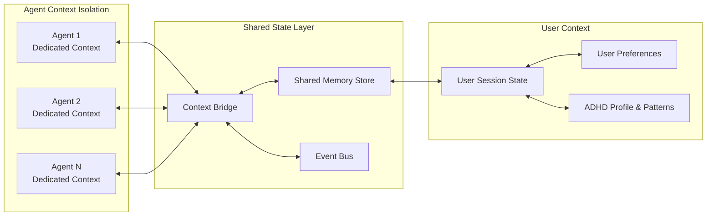

# Multi-Agent Development System Design

## Overview

The Multi-Agent Development System is a comprehensive, neurodivergent-friendly platform that assists developers throughout all stages of software development. The system consists of specialized agents with dedicated context windows, each enhanced by MCP (Model Context Protocol) servers for extended capabilities. The architecture prioritizes ADHD-friendly workflows, habit building, and cognitive accessibility while maintaining high technical capability.

### Core Design Principles

1. **Neurodivergent-First Design**: All interfaces and workflows are optimized for ADHD and other neurodivergent thinking patterns
2. **Context Isolation**: Each agent maintains separate context windows to prevent cognitive overload and maintain specialization
3. **Habit Building**: Agents actively help users develop better thinking, learning, and organizational habits
4. **Extensibility**: MCP server integration allows agents to leverage external tools and services
5. **Gentle Guidance**: Non-judgmental, supportive interactions that work with the user's natural patterns

## Architecture

### High-Level System Architecture

```mermaid
graph TB
    User[User Interface] --> Orchestrator[Orchestration Agent]
    
    Orchestrator --> Research[Research Agent]
    Orchestrator --> Memory[Memory Management Agent]
    Orchestrator --> Documentation[Documentation Agent]
    Orchestrator --> Troubleshooting[Troubleshooting Agent]
    Orchestrator --> CodeReview[Code Review Agent]
    Orchestrator --> Testing[Testing Agent]
    Orchestrator --> Deployment[Deployment Agent]
    Orchestrator --> Brainstorming[Brainstorming Agent]
    Orchestrator --> Organization[Organization Agent]
    Orchestrator --> Security[Security Agent]
    Orchestrator --> Performance[Performance Agent]
    Orchestrator --> Database[Database Agent]
    Orchestrator --> API[API Design Agent]
    Orchestrator --> Focus[Focus Management Agent]
    Orchestrator --> WorkingMemory[Working Memory Agent]
    Orchestrator --> Emotional[Emotional Regulation Agent]
    Orchestrator --> Sensory[Sensory Optimization Agent]
    
    subgraph "MCP Server Layer"
        ByteroverMCP[Byterover Memory Server]
        DatabaseMCP[Database MCP Server]
        APIMCP[API Documentation Server]
        SecurityMCP[Security Analysis Server]
        GitMCP[Git Integration Server]
        AIMCP[AI/ML Tools Server]
    end
    
    Memory --> ByteroverMCP
    Database --> DatabaseMCP
    API --> APIMCP
    Security --> SecurityMCP
    CodeReview --> GitMCP
    Research --> AIMCP
```



### Agent Context Architecture



## Components and Interfaces

### Core Agent Framework

#### Base Agent Interface

```typescript
interface BaseAgent {
  id: string;
  name: string;
  specialization: string;
  contextWindow: AgentContext;
  mcpServers: MCPServerConfig[];
  adhdProfile: ADHDProfile;
  
  // Core methods
  initialize(config: AgentConfig): Promise<void>;
  processRequest(request: AgentRequest): Promise<AgentResponse>;
  shareContext(targetAgent: string, context: ContextData): Promise<void>;
  receiveContext(sourceAgent: string, context: ContextData): Promise<void>;
  
  // ADHD-friendly methods
  assessUserState(): Promise<UserState>;
  adaptToEnergyLevel(level: EnergyLevel): void;
  provideSensoryFeedback(type: SensoryFeedbackType): void;
  buildHabit(habit: HabitPattern): Promise<void>;
}
```

#### Agent Context Management

```typescript
interface AgentContext {
  id: string;
  maxTokens: number;
  currentTokens: number;
  conversationHistory: Message[];
  workingMemory: WorkingMemoryItem[];
  contextSnapshots: ContextSnapshot[];
  
  // ADHD-specific context
  attentionState: AttentionState;
  energyLevel: EnergyLevel;
  sensoryPreferences: SensoryProfile;
  emotionalState: EmotionalState;
  
  // Context management
  createSnapshot(): ContextSnapshot;
  restoreSnapshot(snapshot: ContextSnapshot): void;
  compressOldContext(): void;
  transferContext(targetAgent: string, data: ContextData): void;
}
```

### Specialized Agent Implementations

#### 1. Research Agent

**Purpose**: Gather and synthesize technical information with ADHD-friendly presentation

**Key Features**:
- Multi-source information gathering
- Visual mind-mapping of research findings
- Interest-driven exploration paths
- Hyperfocus session support

**MCP Integrations**:
- Web search servers
- Documentation servers
- Academic paper servers
- Code repository servers

#### 2. Memory Management Agent (Enhanced with Byterover)

**Purpose**: Persistent knowledge storage and retrieval with working memory support

**Key Features**:
- Automatic knowledge capture during hyperfocus
- Context restoration after interruptions
- Pattern recognition across sessions
- External memory aids for working memory limitations

**MCP Integrations**:
- Byterover memory server for persistent storage
- Vector database for semantic search
- Knowledge graph servers

#### 3. Brainstorming & Ideation Agent

**Purpose**: Support divergent thinking and creative exploration

**Key Features**:
- Rapid idea capture during racing thoughts
- Non-linear connection mapping
- Time-boxed creative exercises
- Tangent parking and exploration

**ADHD Optimizations**:
- Stream-of-consciousness capture
- Visual idea clustering
- Interest-based exploration paths
- Hyperfocus channeling techniques

#### 4. Organization & Planning Agent

**Purpose**: Structure ideas into actionable plans with executive function support

**Key Features**:
- Micro-task breakdown
- Visual project hierarchies
- Energy-level task matching
- Dopamine-reward optimization

**ADHD Optimizations**:
- Overwhelming goal decomposition
- Context switching support
- Progress visualization
- Gentle deadline management

#### 5. Focus & Attention Management Agent

**Purpose**: Optimize attention cycles and work with neurodivergent patterns

**Key Features**:
- Attention state monitoring
- Hyperfocus session management
- Distraction capture and deferral
- Energy-based task suggestion

**ADHD Optimizations**:
- Time blindness compensation
- Sensory environment optimization
- Transition ritual support
- Procrastination pattern analysis

#### 6. Working Memory & Context Support Agent

**Purpose**: Provide external cognitive support for executive function challenges

**Key Features**:
- Mental model externalization
- Context snapshot creation
- Information chunking
- Quick restoration paths

**ADHD Optimizations**:
- Visual context representations
- Cognitive load monitoring
- Seamless context switching
- Working memory offloading

#### 7. Emotional Regulation & Motivation Agent

**Purpose**: Support emotional well-being and sustainable productivity

**Key Features**:
- Rejection sensitivity support
- Motivation pattern recognition
- Perfectionism management
- Burnout prevention

**ADHD Optimizations**:
- Emotional dysregulation support
- Dopamine management strategies
- Confidence building techniques
- Resilience development

#### 8. Sensory & Environment Optimization Agent

**Purpose**: Create optimal sensory environments for focus and productivity

**Key Features**:
- Sensory assessment and optimization
- Environment configuration suggestions
- Overstimulation prevention
- Portable accommodation solutions

**ADHD Optimizations**:
- Sensory preference learning
- Stimming support integration
- Hypersensitivity management
- Focus anchor creation

### MCP Server Integration Layer

#### MCP Server Configuration

```typescript
interface MCPServerConfig {
  name: string;
  type: 'stdio' | 'http' | 'websocket';
  command?: string;
  args?: string[];
  env?: Record<string, string>;
  url?: string;
  timeout?: number;
  retryPolicy?: RetryPolicy;
  
  // ADHD-specific configurations
  sensoryFeedback?: SensoryFeedbackConfig;
  attentionSupport?: AttentionSupportConfig;
}
```

#### Key MCP Server Integrations

1. **Byterover Memory Server**
   - Persistent knowledge storage
   - Semantic search capabilities
   - Context preservation across sessions
   - Pattern recognition and learning

2. **Database Integration Server**
   - Schema design and optimization
   - Query performance analysis
   - Migration management
   - Data integrity monitoring

3. **API Documentation Server**
   - OpenAPI specification generation
   - Interactive documentation
   - Testing endpoint creation
   - Version management

4. **Security Analysis Server**
   - Vulnerability scanning
   - Security best practice checking
   - Dependency analysis
   - Compliance monitoring

5. **Git Integration Server**
   - Code review automation
   - Commit message generation
   - Branch management
   - Merge conflict resolution

## Data Models

### User Profile and ADHD Patterns

```typescript
interface ADHDProfile {
  // Attention patterns
  attentionSpan: {
    typical: number;
    hyperfocus: number;
    distractible: number;
  };
  
  // Energy patterns
  energyCycles: {
    peakHours: TimeRange[];
    lowEnergyHours: TimeRange[];
    optimalTaskTypes: Record<EnergyLevel, TaskType[]>;
  };
  
  // Sensory preferences
  sensoryProfile: {
    visualPreferences: VisualPreferences;
    auditoryPreferences: AuditoryPreferences;
    tactilePreferences: TactilePreferences;
    environmentalNeeds: EnvironmentalNeeds;
  };
  
  // Emotional patterns
  emotionalPatterns: {
    rejectionSensitivity: SensitivityLevel;
    motivationTriggers: MotivationTrigger[];
    regulationStrategies: RegulationStrategy[];
  };
  
  // Learning preferences
  learningProfile: {
    preferredModalities: LearningModality[];
    interestAreas: string[];
    comprehensionStrategies: ComprehensionStrategy[];
  };
}
```

### Context and Memory Models

```typescript
interface ContextSnapshot {
  id: string;
  timestamp: Date;
  agentId: string;
  
  // Core context
  conversationState: ConversationState;
  workingMemory: WorkingMemoryItem[];
  currentTask: TaskContext;
  
  // ADHD-specific context
  attentionState: AttentionState;
  energyLevel: EnergyLevel;
  emotionalState: EmotionalState;
  sensoryEnvironment: SensoryEnvironment;
  
  // Restoration metadata
  restorationCues: RestorationCue[];
  priorityItems: PriorityItem[];
  quickAccessPaths: QuickAccessPath[];
}

interface WorkingMemoryItem {
  id: string;
  type: 'concept' | 'task' | 'context' | 'pattern';
  content: any;
  importance: number;
  lastAccessed: Date;
  associatedConcepts: string[];
  visualRepresentation?: VisualElement;
}
```

### Task and Habit Models

```typescript
interface Task {
  id: string;
  title: string;
  description: string;
  
  // ADHD optimizations
  estimatedDuration: number;
  energyRequirement: EnergyLevel;
  cognitiveLoad: CognitiveLoad;
  dopamineReward: RewardLevel;
  
  // Breakdown and structure
  subtasks: Subtask[];
  dependencies: string[];
  completionCriteria: CompletionCriteria[];
  
  // Context and support
  requiredContext: ContextRequirement[];
  supportingResources: Resource[];
  potentialObstacles: Obstacle[];
}

interface HabitPattern {
  id: string;
  name: string;
  category: HabitCategory;
  
  // Pattern definition
  trigger: HabitTrigger;
  routine: HabitRoutine;
  reward: HabitReward;
  
  // ADHD considerations
  cognitiveLoad: CognitiveLoad;
  executiveFunctionSupport: ExecutiveFunctionSupport[];
  sensoryAnchors: SensoryAnchor[];
  
  // Progress tracking
  streakCount: number;
  successRate: number;
  adaptations: HabitAdaptation[];
}
```

## Error Handling

### ADHD-Friendly Error Management

#### Gentle Error Communication

```typescript
interface ADHDFriendlyError {
  // Standard error info
  code: string;
  message: string;
  details: ErrorDetails;
  
  // ADHD-specific presentation
  emotionalTone: 'supportive' | 'encouraging' | 'neutral';
  cognitiveLoad: 'low' | 'medium' | 'high';
  visualPresentation: VisualErrorPresentation;
  
  // Recovery support
  recoverySteps: RecoveryStep[];
  alternativeApproaches: AlternativeApproach[];
  contextPreservation: ContextPreservationStrategy;
  
  // Emotional regulation
  rejectionSensitivityMitigation: boolean;
  confidenceBuilding: ConfidenceBuildingMessage[];
  progressAcknowledgment: ProgressAcknowledgment;
}
```

#### Error Recovery Patterns

1. **Context Preservation**: Automatically save current state before error handling
2. **Gentle Redirection**: Provide supportive guidance without blame
3. **Alternative Paths**: Offer multiple approaches to overcome obstacles
4. **Learning Integration**: Turn errors into learning opportunities
5. **Emotional Support**: Address potential rejection sensitivity or frustration

### System Resilience

#### Agent Failure Handling

- **Graceful Degradation**: Other agents continue functioning if one fails
- **Context Recovery**: Automatic context restoration after agent restart
- **MCP Server Fallbacks**: Alternative servers or offline modes when connections fail
- **User Notification**: Clear, non-alarming communication about system status

#### Data Consistency

- **Eventual Consistency**: Allow for temporary inconsistencies during high cognitive load periods
- **Conflict Resolution**: Gentle conflict resolution with user guidance
- **Backup Strategies**: Multiple backup mechanisms for critical user data
- **Recovery Verification**: Verify data integrity after recovery operations

## Testing Strategy

### ADHD-Friendly Testing Approach

#### User Experience Testing

1. **Cognitive Load Testing**
   - Measure cognitive burden of different interfaces
   - Test with users during different energy states
   - Validate sensory optimization effectiveness

2. **Attention Pattern Testing**
   - Test system behavior during hyperfocus sessions
   - Validate distraction handling mechanisms
   - Measure context switching efficiency

3. **Emotional Response Testing**
   - Test rejection sensitivity mitigation
   - Validate motivational messaging effectiveness
   - Measure emotional regulation support quality

#### Technical Testing

1. **Agent Isolation Testing**
   - Verify context window isolation
   - Test inter-agent communication
   - Validate memory management

2. **MCP Server Integration Testing**
   - Test server connection reliability
   - Validate fallback mechanisms
   - Measure performance impact

3. **Performance Testing**
   - Response time optimization for ADHD attention spans
   - Memory usage optimization
   - Concurrent agent operation testing

#### Accessibility Testing

1. **Sensory Accessibility**
   - Visual contrast and clarity testing
   - Audio feedback testing
   - Tactile feedback validation

2. **Cognitive Accessibility**
   - Information chunking effectiveness
   - Navigation simplicity testing
   - Error message clarity validation

3. **Neurodivergent User Testing**
   - Testing with ADHD users across different presentations
   - Validation with other neurodivergent conditions
   - Long-term usage pattern analysis

### Continuous Improvement

#### Learning and Adaptation

- **Usage Pattern Analysis**: Learn from user behavior to improve recommendations
- **Habit Formation Tracking**: Monitor and optimize habit-building effectiveness
- **Personalization Enhancement**: Continuously refine ADHD profile accuracy
- **Agent Specialization**: Improve agent expertise through usage feedback

#### Performance Monitoring

- **Response Time Tracking**: Ensure responses meet ADHD attention requirements
- **Context Switch Efficiency**: Monitor and optimize context switching performance
- **Memory Usage Optimization**: Prevent cognitive overload through efficient memory management
- **Error Rate Reduction**: Continuously improve system reliability and user experience