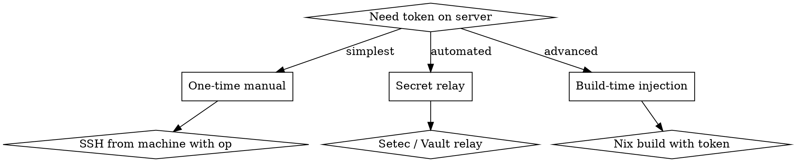

# Bootstrapping 1Password Tokens to Headless Servers

## Overview

The chicken-and-egg problem: you need `OP_SERVICE_ACCOUNT_TOKEN` to fetch secrets from 1Password, but the token itself is a secret that must be placed on the server. How do you get it there securely?

**Core principle:** The token must reach the server through a channel that doesn't require secrets already being present.

## When to Use

- Setting up opnix on a new NixOS server
- Deploying 1Password integration to a machine without `op` CLI signed in
- Automating server provisioning where secrets aren't available at install time
- Migrating from hardcoded secrets to 1Password-managed secrets

## Bootstrap Methods



### Method 1: Manual Placement (Simplest)

Best for: one server, already have `op` CLI available somewhere.

```bash
# From a machine with op CLI signed in (e.g., your desktop via Tailscale)
OP_TOKEN=$(op read op://hbohlen-systems/opnix/token --no-newline)

# Place on server via SSH
ssh hbohlen@server "echo '$OP_TOKEN' | sudo tee /etc/opnix-token > /dev/null"
ssh hbohlen@server "sudo chmod 640 /etc/opnix-token && sudo chown root:users /etc/opnix-token"
```

**Pros:** Simple, no extra infrastructure
**Cons:** Manual, doesn't scale, token in shell history

### Method 2: Secret Relay (Automated)

Best for: multiple servers, want zero-touch provisioning.

Use a secret relay service on the tailnet (e.g., Tailscale's `setec`, HashiCorp Vault, or a simple HTTPS endpoint with mTLS).

```bash
# On the relay server (already has op CLI)
TOKEN=$(op read op://hbohlen-systems/opnix/token --no-newline)
tailscale setec put opnix-token "$TOKEN"

# On new server (NixOS module or systemd service)
systemd.services.fetch-token = {
  description = "Fetch opnix token from relay";
  after = [ "network.target" "tailscaled.service" ];
  wantedBy = [ "multi-user.target" ];
  serviceConfig = {
    Type = "oneshot";
    RemainAfterExit = true;
    ExecStart = pkgs.writeScript "fetch-token" ''
      #!${pkgs.bash}/bin/bash
      sleep 10  # wait for Tailscale
      TOKEN=$(tailscale --host=setec setec get opnix-token 2>/dev/null || echo "")
      if [ -n "$TOKEN" ]; then
        echo "$TOKEN" > /etc/opnix-token
        chmod 640 /etc/opnix-token
      fi
    '';
  };
};
```

**Pros:** Fully automated, scales to many servers
**Cons:** Requires relay infrastructure, relay is a single point of failure

### Method 3: Remote `op` CLI (Hybrid)

Best for: have a bastion/admin machine with `op` CLI.

```bash
# Run op CLI remotely via SSH
ssh hbohlen@bastion "op read op://hbohlen-systems/opnix/token --no-newline" | \
  ssh hbohlen@target "sudo tee /etc/opnix-token > /dev/null"
```

**Pros:** No extra infrastructure, token never in local shell
**Cons:** Requires bastion with `op` CLI

## Token File Requirements

```bash
# Permissions
sudo chmod 640 /etc/opnix-token

# Ownership: depends on who reads it
sudo chown root:users /etc/opnix-token        # if user-level HM reads it
sudo chown root:onepassword-secrets /etc/opnix-token  # if NixOS module group exists

# Verify
ls -la /etc/opnix-token
# Expected: -rw-r----- 1 root users 853 ...
```

## Post-Bootstrap Verification

After placing the token:

```bash
# 1. Token exists and is readable
cat /etc/opnix-token | wc -c  # Should be > 0

# 2. op CLI works with the token
export OP_SERVICE_ACCOUNT_TOKEN=$(cat /etc/opnix-token)
op account list

# 3. Trigger secret fetch
sudo nixos-rebuild switch --flake .#hostname

# 4. Secrets are written
ls -la ~/.ssh/                    # HM secrets
ls -la /var/lib/opnix/secrets/    # NixOS secrets (if enabled)
```

## Common Mistakes

| Mistake | Fix |
|---------|-----|
| Token in shell history | Use pipes, not variables in interactive shells |
| Token file `644` (world-readable) | Use `640` with proper group |
| HM service runs as user but token owned by root:root | Change group to `users` or add user to group |
| Placing token AFTER first `nixos-rebuild switch` | HM activation ran without token; restart the service or rebuild again |
| NixOS module creates `onepassword-secrets` group but token not in it | Set `chown root:onepassword-secrets` |
| `opnix token set` fails on headless (interactive prompt) | Use manual file placement instead |

## Decision: Which Method?

```
Single server?         → Method 1 (manual)
Multiple servers?      → Method 2 (relay) or Method 3 (bastion)
Zero-touch needed?     → Method 2 (relay)
No relay infra?        → Method 1 or 3
New server via nixos-anywhere? → Hardcode authkey, use relay for opnix token
```
