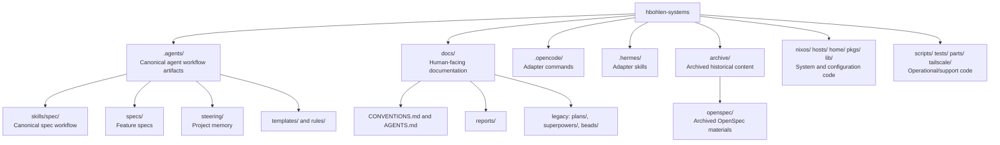
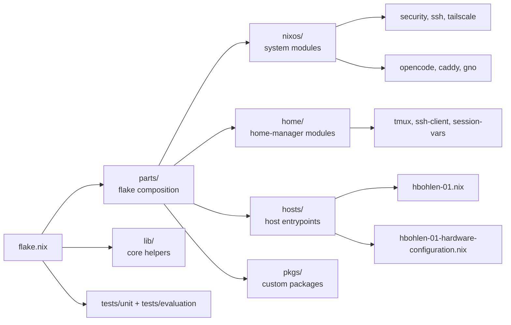
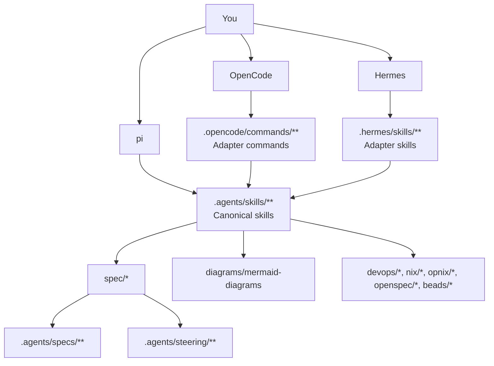
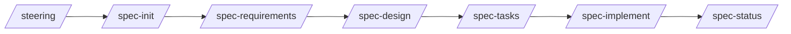
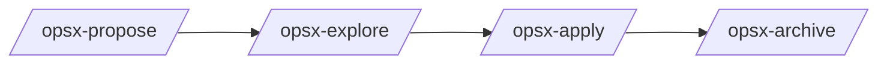

# Codebase State and Spec Workflow Diagrams

**Date:** 2026-04-09  
**Purpose:** Visualize the current repository layout and the recommended `.agents/skills/spec` workflow usage.

---

## 1) Current codebase state (high-level)



---

## 2) How to use the spec skills workflow

```mermaid
flowchart TD
    Start([Start feature work]) --> Steering[/steering<br/>refresh project memory]
    Steering --> Init[/spec-init "feature description"/]
    Init --> Req[/spec-requirements feature/]
    Req --> Gap{Need gap check?}
    Gap -- Yes --> GapCmd[/spec-validate-gap feature/]
    Gap -- No --> Design
    GapCmd --> Design[/spec-design feature/]
    Design --> DesignCheck{Need design review?}
    DesignCheck -- Yes --> ValidateDesign[/spec-validate-design feature/]
    DesignCheck -- No --> Tasks
    ValidateDesign --> Tasks[/spec-tasks feature/]
    Tasks --> Implement[/spec-implement feature/]
    Implement --> ImplCheck{Need implementation review?}
    ImplCheck -- Yes --> ValidateImpl[/spec-validate-implementation feature/]
    ImplCheck -- No --> Status
    ValidateImpl --> Status[/spec-status feature/]
    Status --> Done([Done / iterate])
```

---

## 3) Practical usage notes

- Use `.agents/skills/spec/` as the source of truth for spec commands.
- Put feature artifacts in `.agents/specs/<feature>/`.
- Keep durable human-facing documentation in `docs/` and place one-time summaries in `docs/reports/`.
- Keep deprecated/superseded materials in `archive/` for review before deletion.

---

## 4) Module map + where to look first for changes



### Change targeting quick guide

- **Host behavior or services** → start in `hosts/` then follow imports into `nixos/`.
- **User shell/session behavior** → `home/`.
- **Shared flake wiring/outputs** → `parts/` and `lib/`.
- **Package-level customizations** → `pkgs/`.
- **Safety checks/regression** → `tests/unit/` and `tests/evaluation/`.

---

## 5) Tooling and access architecture (canonical vs adapters)



---

## 6) Command flows for day-to-day work

### Spec-driven feature delivery (recommended default)



### OpenSpec lifecycle (for OpenSpec-managed changes)



### Beads loop (task selection and closure)

```mermaid
flowchart LR
    B1[bd ready --json] --> B2[bd update <id> --claim]
    B2 --> B3[Implement + validate]
    B3 --> B4[bd close <id> --reason "..."]
    B4 --> B5[bd sync]
```
