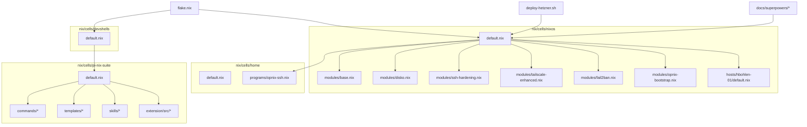
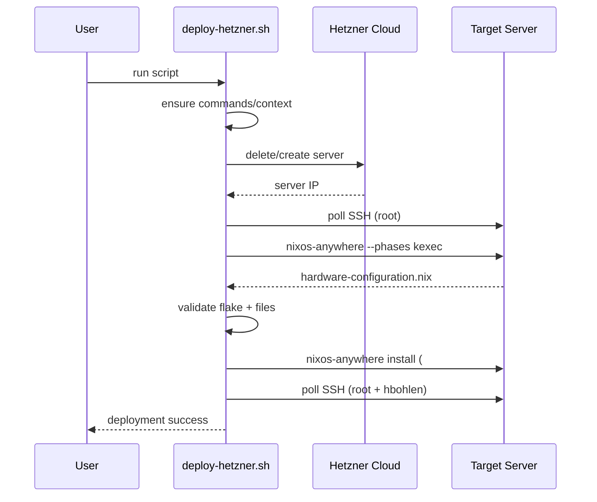
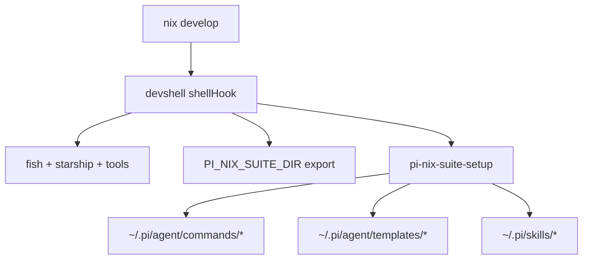

# hbohlen-systems: Deep Codebase Review

Date: 2026-03-31
Repository: `hbohlen/hbohlen-systems`

## 1) Executive Summary

This repository is a modular Nix-flake infrastructure project centered on:

- A reproducible developer shell (`nix/cells/devshells`)
- A NixOS host deployment for Hetzner (`nix/cells/nixos`, `deploy-hetzner.sh`)
- Home Manager user configuration (`nix/cells/home`)
- A pi coding-agent integration package (`nix/cells/pi-nix-suite`)
- Operational docs under `docs/superpowers/`

Overall, the architecture is clean and compositional. The largest risk area is secret handling in bootstrap/deployment paths. The strongest areas are declarative infrastructure, modularity, and practical deployment automation.

## 2) Repository Documentation (Structure + Responsibilities)

### Top-level map

- `flake.nix`
  - Root orchestrator. Imports cells and defines supported systems.
- `nix/cells/devshells/default.nix`
  - Defines the dev shell packages, shell hook, fish setup, and pi-nix-suite bootstrap.
- `nix/cells/nixos/default.nix`
  - Defines `flake.nixosConfigurations.hbohlen-01` and the module import chain.
- `nix/cells/nixos/modules/*.nix`
  - Base system, disko layout, SSH hardening, fail2ban, tailscale, opnix bootstrap.
- `nix/cells/nixos/hosts/hbohlen-01/default.nix`
  - Host-specific settings and deploy key placement.
- `nix/cells/home/default.nix`
  - Standalone Home Manager configuration output.
- `nix/cells/home/programs/opnix-ssh.nix`
  - SSH + environment variable integration for opnix token file.
- `nix/cells/pi-nix-suite/`
  - Packaged commands/templates/skills and extension source.
- `deploy-hetzner.sh`
  - End-to-end Hetzner provision + hardware discovery + NixOS installation workflow.
- `docs/superpowers/`
  - Specs/plans/references for design and operations.

### Flake composition

`flake.nix` imports:

- `./nix/cells/devshells`
- `./nix/cells/nixos`

And exposes supported systems:

- `x86_64-linux`
- `aarch64-linux`
- `aarch64-darwin`

### NixOS host composition (`hbohlen-01`)

`nix/cells/nixos/default.nix` composes modules in this order:

1. `inputs.home-manager.nixosModules.default`
2. `inputs.disko.nixosModules.disko`
3. `./modules/disko.nix`
4. `./modules/base.nix`
5. `./modules/ssh-hardening.nix`
6. `./modules/tailscale-enhanced.nix`
7. `./modules/fail2ban.nix`
8. Inline Home Manager user wiring (`home-manager.users.hbohlen = import ../home/programs/opnix-ssh.nix`)
9. `./modules/opnix-bootstrap.nix`
10. `./hosts/hbohlen-01/default.nix`

### Home Manager composition

- Standalone HM output exists at `nix/cells/home/default.nix` (`flake.homeConfigurations.hbohlen`).
- NixOS-integrated HM is also wired directly inside `nix/cells/nixos/default.nix`.

### Deployment workflow script

`deploy-hetzner.sh` performs:

1. Validate required commands/context (`hcloud`, `nix`, `ssh`, `ssh-keygen`)
2. Delete/recreate target Hetzner server
3. Resolve server IP and poll SSH readiness
4. Run `nixos-anywhere --phases kexec` to generate hardware config into `nix/cells/nixos/hosts/hbohlen-01/hardware-configuration.nix`
5. Validate local required files and flake evaluation assumptions
6. Run `nixos-anywhere` install against `#hbohlen-01`
7. Post-install SSH checks for `root` and `hbohlen`

## 3) Architecture Diagrams

### 3.1 Component architecture



### 3.2 Hetzner deployment sequence



### 3.3 Secret bootstrap flow (tailscale + opnix)

```mermaid
graph LR
  A[NixOS boot] --> B[tailscaled.service starts]
  B --> C[opnix-bootstrap oneshot]
  C --> D[tailscale --host=setec setec get opnix-token]
  D --> E[/etc/opnix-token]
  E --> F[Home Manager env: OP_SERVICE_ACCOUNT_TOKEN_FILE]
```

### 3.4 Developer workflow (devshell + pi-nix-suite)



## 4) Strengths

1. **Clear modular flake structure**
   - Cells separate concerns for devshell, NixOS, Home Manager, and agent tooling.
2. **Practical deployment automation**
   - `deploy-hetzner.sh` includes validation, generation, install, and post-check flow.
3. **Security hardening intent is explicit**
   - SSH hardening (`ssh-hardening.nix`) and fail2ban (`fail2ban.nix`) are in place.
4. **Developer experience is curated**
   - Rich shell setup and direct integration with `pi-nix-suite` commands and templates.
5. **Documentation culture already exists**
   - Extensive specs/plans/references under `docs/superpowers/`.

## 5) Findings and Improvement Suggestions

### High priority

1. **Remove embedded Tailscale auth key from source**
   - File: `nix/cells/nixos/modules/opnix-bootstrap.nix`
   - Current module hardcodes `tailscaleAuthKey`.
   - Recommendation: move auth key to encrypted secret workflow (e.g., sops/agenix or equivalent), and inject via secret file path at runtime.

2. **Unify Tailscale ownership into one module**
   - Files: `nix/cells/nixos/modules/tailscale-enhanced.nix`, `nix/cells/nixos/modules/opnix-bootstrap.nix`
   - Both modules define `services.tailscale` settings, which can cause ambiguity and unexpected merges.
   - Recommendation: keep full Tailscale service config in a single module, leave bootstrap module focused only on token retrieval service.

3. **Harden token write path in bootstrap service**
   - File: `nix/cells/nixos/modules/opnix-bootstrap.nix`
   - Current script writes token directly and then `chmod 600`.
   - Recommendation: write with restrictive permissions from creation (`install -m 600` / temporary file + atomic move), and return non-zero on repeated fetch failure.

### Medium priority

4. **Add retry/backoff and explicit failure policy for bootstrap**
   - File: `nix/cells/nixos/modules/opnix-bootstrap.nix`
   - Current logic logs warning on failure but continues.
   - Recommendation: use bounded retries + backoff + clear systemd failure semantics (`Restart=on-failure` or explicit alerting path).

5. **Protect deployment logs from sensitive material**
   - File: `deploy-hetzner.sh`
   - Script tees all output to `deploy.log`.
   - Recommendation: redact known secret patterns before persisting, or write sensitive operations with reduced logging verbosity.

6. **Consolidate Home Manager strategy in docs**
   - Files: `nix/cells/home/default.nix`, `nix/cells/nixos/default.nix`
   - Both standalone and NixOS-embedded HM exist; this is fine but should be explicitly documented as intentional with usage guidance.

### Low priority

7. **Add CI gate for flake evaluation/checking**
   - Suggested checks: `nix flake check`, `nix flake show`, and targeted evals used by deployment assumptions.

8. **Add an operations runbook for post-deploy verification and rollback**
   - Include service health checks, token presence verification, and incident recovery paths.

9. **Document pi-nix-suite extension build status and expectations**
   - `nix/cells/pi-nix-suite/extension` currently shows TypeScript type-check errors in this environment.
   - Add an explicit note on expected package/API versions and current known issues.

## 6) Suggested next-step roadmap

1. **Security first (immediate):** externalize Tailscale auth secret.
2. **Reliability second:** bootstrap retries + fail policy, token write hardening.
3. **Maintainability third:** single-source tailscale config ownership and Home Manager strategy docs.
4. **Quality guardrails:** add CI checks for flake health.

## 7) Validation Notes for This Review

- The review is based on direct repository inspection of the files cited above.
- In this execution environment, `nix` is unavailable (`nix: command not found`), so Nix runtime checks could not be executed here.
- Existing TypeScript check in `nix/cells/pi-nix-suite/extension` reports pre-existing errors unrelated to this documentation addition.
